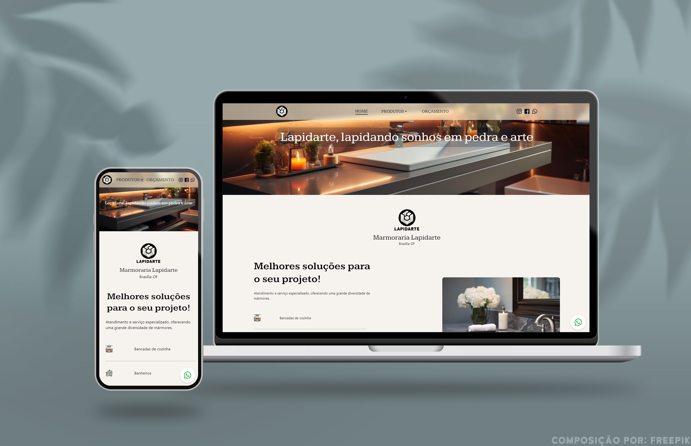

    <h1>Repositório da aplicação Marmoraria Lapidarte</h1>

  

## Sobre
Este é o repositório da aplicação da Marmoraria Lapidarte, desenvolvida para ajudar a empresa a expor seus produtos e permitir que os clientes solicitem orçamentos de forma fácil e conveniente. A aplicação é responsiva, possui proteção de rotas, navegação suave e um sistema de persistência de dados em cache usando localStorage. Além disso, inclui um carrossel de imagens e uma página de gerenciamento de produtos com operações CRUD e envio de imagens utilizando Firebase.

## Link da aplicação

Visite a [marmorarialapidarte.com.br](https://marmorarialapidarte.com.br/) para experimentar a aplicação em funcionamento.

## Tecnologias utilizadas
* Next.js 14.1.0
* React.js ^18
* Typescript ^5
* Firebase ^10.8.1
* TailwindCSS ^3.3.3
